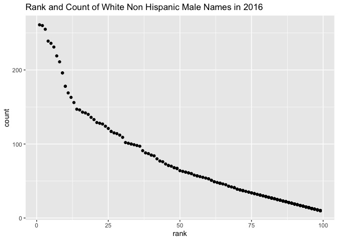

p8105\_hw2\_kb3066
================
Kaila Boyer
10/3/2021

## Problem 1

omit rows that do not include dumpster-specific data Cleaning Mr.Trash
Wheel sheet

``` r
trash_wheel <- read_excel("Trash-Wheel-Collection-Totals-7-2020-2.xlsx", sheet = 1, range = "A2:N535") %>% janitor::clean_names()

trash_wheel <- trash_wheel %>% filter(!is.na(dumpster) & !is.na(year)) %>% 
                               mutate(sports_balls = round(sports_balls), 
                                      date = lubridate::ymd(date))

trash_wheel %>% filter(year == 2019) %>% summarise(med_sb = median(sports_balls))
```

    ## # A tibble: 1 × 1
    ##   med_sb
    ##    <dbl>
    ## 1      9

Precipitation sheets

``` r
precip_2018 <- read_excel("Trash-Wheel-Collection-Totals-7-2020-2.xlsx", sheet = 7, 
                          range = "A2:B14") %>% janitor::clean_names()

precip_2019 <- read_excel("Trash-Wheel-Collection-Totals-7-2020-2.xlsx", sheet = 6, 
                          range = "A2:B14") %>% janitor::clean_names()
precip_2018 <- precip_2018 %>% mutate(year = "2018", 
                                      month = month.name)

precip_2019 <- precip_2019 %>% mutate(year = "2019", 
                                      month = month.name)
```

Merging precipitation data

``` r
precip_merged <- bind_rows(precip_2018, precip_2019)

precip_merged %>% group_by(year) %>% summarise(totals = sum(total)) %>% knitr::kable()
```

| year | totals |
|:-----|-------:|
| 2018 |  70.33 |
| 2019 |  33.95 |

`In the Mr. Trashwheel dataset there are 453 observations and 14 columns. It includes variables on the various categories of litter and the amount collected. This includes data on cigarette butts, grocery bags, plastic bottles and sports balls. The number of homes powered through the collection of litter is another variable in this dataframe. The median number of sports balls collected by a dumpster in 2019 was 9.`
`The precipitation data contains variables for the monthly precipitation totals. The data frames from 2018 and 2019 had 12 observations, one for each month, along with a month and total precipitation variable. The total precipitation in 2018 was 70.33 inches.`

## Problem 2

pols\_month dataframe

``` r
pols_month <- read_csv("fivethirtyeight_datasets/pols-month.csv") %>% janitor::clean_names()
```

    ## Rows: 822 Columns: 9

    ## ── Column specification ────────────────────────────────────────────────────────
    ## Delimiter: ","
    ## dbl  (8): prez_gop, gov_gop, sen_gop, rep_gop, prez_dem, gov_dem, sen_dem, r...
    ## date (1): mon

    ## 
    ## ℹ Use `spec()` to retrieve the full column specification for this data.
    ## ℹ Specify the column types or set `show_col_types = FALSE` to quiet this message.

``` r
pols_month <- pols_month %>% 
                  separate(mon, into = c("year", "month", "day")) %>% 
                  mutate(month = rep(month.name, length.out = nrow(pols_month)), 
                         president = if_else(prez_gop == 1 & prez_dem !=1, "Republican", "Democrat"))

pols_month <- pols_month %>% select(!contains("prez"), -day) 
```

SNP dataframe

``` r
snp <- read_csv("fivethirtyeight_datasets/snp.csv")
```

    ## Rows: 787 Columns: 2

    ## ── Column specification ────────────────────────────────────────────────────────
    ## Delimiter: ","
    ## chr (1): date
    ## dbl (1): close

    ## 
    ## ℹ Use `spec()` to retrieve the full column specification for this data.
    ## ℹ Specify the column types or set `show_col_types = FALSE` to quiet this message.

``` r
snp <-snp %>% separate(date, into = c("day", "month", "year")) %>% 
                  mutate(month = rep(month.name, length.out = nrow(snp)), 
                         year = as.numeric(year))  %>% 
                select(-day) 

snp <- snp %>% mutate(year = ifelse( year>=50 & year<=99, year+1900, 
                             ifelse(year>=00 & year<= 15, year+2000, NA)), 
                      year = as.character(year))
```

Unemployment dataframe

``` r
unemployment <- read_csv("fivethirtyeight_datasets/unemployment.csv") %>% janitor::clean_names()
```

    ## Rows: 68 Columns: 13

    ## ── Column specification ────────────────────────────────────────────────────────
    ## Delimiter: ","
    ## dbl (13): Year, Jan, Feb, Mar, Apr, May, Jun, Jul, Aug, Sep, Oct, Nov, Dec

    ## 
    ## ℹ Use `spec()` to retrieve the full column specification for this data.
    ## ℹ Specify the column types or set `show_col_types = FALSE` to quiet this message.

``` r
unemployment <- unemployment %>% pivot_longer(-year, names_to = "month", 
                                             values_to = "percent UE") %>% janitor::clean_names()


unemployment <- unemployment %>% mutate(month = rep(month.name, length.out = nrow(unemployment)), 
                                        year = as.character(year)) 
```

``` r
pols_snp <- pols_month %>% left_join(snp, by = c("year", "month") )

fivethirtyeight_all <- pols_snp %>% left_join(unemployment, by = c("year", "month"))
```

`The pols_month datasets contains information on the number of elected officials in each political party for each day, starting in January 1947 until June 2015. This includes the number of Republicans and Democrats in office for President, Congress (Senators and Representatives), and Governors. This dataset has 822 observations and 9 variables.`
`The snp dataset has information on the closing values of the S&P index on a given date. It has two variables (date and closing value) and it has 787 observations.The time ranges from 1950 to 2015.`
`The unemployment dataset has information on the percent unemployment for each month. After transforming it to a longer format, it has 816 observations and 3 variables (year, month, and percent). The years range from 1948 to 2015.`
`Merging all three datasets result in a larger dataframe with 822 observations and 11 variables. Like with pols_month, the earliest time provided is January 1947 and the latest is June 2015. The earliest date with closing S&P index values and a percent unemployment is 1950.`

## Problem 3

Load and tidy the data. Note that, although these data may seem fairly
well formatted initially, the names of a categorical predictor and the
case structure of string variables changed over time; you’ll need to
address this in your data cleaning. Also, some rows seem duplicated, and
these will need to be removed (hint: google something like “dplyr remove
duplicate rows” to get started).

Produce a well-structured, reader-friendly table showing the rank in
popularity of the name “Olivia” as a female baby name over time; this
should have rows for ethnicities and columns for year. Produce a similar
table showing the most popular name among male children over time.

Finally, for male, white non-hispanic children born in 2016, produce a
scatter plot showing the number of children with a name (y axis) against
the rank in popularity of that name (x axis).

Baby names data

``` r
baby_names <- read_csv("Popular_Baby_Names.csv") %>% 
                          janitor::clean_names() %>% 
                          distinct() %>% 
                          mutate(gender = str_to_lower(gender), 
                                 ethnicity = str_to_lower(ethnicity), 
                                 year_of_birth = as.character(year_of_birth), 
                                 childs_first_name = str_to_sentence(childs_first_name)) 
```

    ## Rows: 19418 Columns: 6

    ## ── Column specification ────────────────────────────────────────────────────────
    ## Delimiter: ","
    ## chr (3): Gender, Ethnicity, Child's First Name
    ## dbl (3): Year of Birth, Count, Rank

    ## 
    ## ℹ Use `spec()` to retrieve the full column specification for this data.
    ## ℹ Specify the column types or set `show_col_types = FALSE` to quiet this message.

``` r
Hmisc::describe(baby_names$ethnicity)
```

    ## baby_names$ethnicity 
    ##        n  missing distinct 
    ##    12181        0        7 
    ## 
    ## lowest : asian and paci             asian and pacific islander black non hisp             black non hispanic         hispanic                  
    ## highest: black non hisp             black non hispanic         hispanic                   white non hisp             white non hispanic        
    ## 
    ## asian and paci (358, 0.029), asian and pacific islander (1782, 0.146), black
    ## non hisp (353, 0.029), black non hispanic (1833, 0.150), hispanic (3564,
    ## 0.293), white non hisp (701, 0.058), white non hispanic (3590, 0.295)

``` r
baby_names <- baby_names %>% mutate(
                                   ethnicity = if_else(ethnicity == "asian and paci" | ethnicity == "asian and pacific islander", "Asian and Pacific Islander", 
                                                       if_else(ethnicity == "black non hisp" | ethnicity == "black non hispanic", "Black Non Hispanic", 
                                                               if_else(ethnicity == "white non hispanic" | ethnicity == "white non hisp", "White Non Hispanic", "Hispanic")))
)
```

Oliva dataframe

``` r
olivia <- baby_names %>% filter(childs_first_name == "Olivia") %>% 
  pivot_wider(names_from = year_of_birth, 
              values_from = c(rank, count)) %>% 
  mutate(ethnicity = as.factor(ethnicity)) %>% 
  select(-gender, -starts_with("count"))
```

``` r
ethan <- baby_names %>% filter(gender == "male" & childs_first_name == "Ethan") %>% 
  pivot_wider(names_from = year_of_birth, 
              values_from = c(rank, count)) %>% 
  mutate(ethnicity = as.factor(ethnicity)) %>% 
  select(-gender, -starts_with("count"))
```

Finally, for male, white non-hispanic children born in 2016, produce a
scatter plot showing the number of children with a name (y axis) against
the rank in popularity of that name (x axis).

``` r
baby_names %>% filter(gender == "male" & ethnicity == "White Non Hispanic" & year_of_birth == 2016) %>% 
  ggplot(aes(x = rank, y = count)) + 
  geom_point() + 
  labs( 
    title = "Rank and Count of White Non Hispanic Male Names in 2016"
      )
```

<!-- -->
